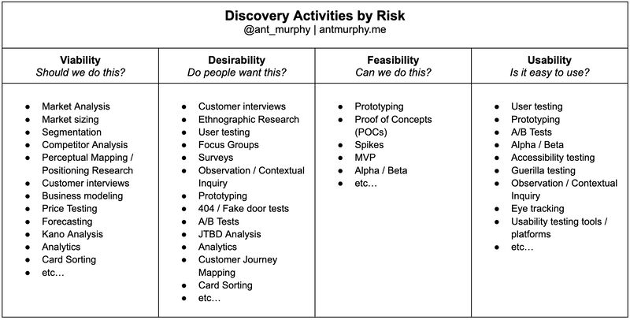

1) [[Frame the Opportunity]] (simple [[Business Model Canvas]])
	1) Adaptability
	2) Feasibility
	3) Desirability
	4) Viability
2) Map your Assumptions`
	1) Risk: Important / Not Important
	2) [[De-risking]]: Have evidence / No Evidence
3) Build a Discovery backlog
	1) Focus on the (Important + No Evidence) assumptions
4) Define your tests (see below and [cheatsheet](https://www.linkedin.com/posts/ant-murphy_productmanagement-product-agile-activity-7077049982826016768-D7gu?utm_source=share&utm_medium=member_desktop))
5) Timebox ([[Stagnation = Death]])

- [Assumptions mapping on Mural website](https://www.mural.co/blog/intro-assumptions-mapping)
- [LinkedIN post by Ant Murphy 1](https://www.linkedin.com/posts/ant-murphy_productmanagement-product-agile-activity-7077049982826016768-D7gu?utm_source=share&utm_medium=member_desktop)
- [LinkedIN post by Ant Murphy 2](https://www.linkedin.com/posts/ant-murphy_ive-helped-half-a-dozen-orgs-intro-discovery-activity-7110427418137423873-RWYa?utm_source=share&utm_medium=member_desktop)
- [How assumptions mapping can focus your team on experiments that matter](https://www.strategyzer.com/library/how-assumptions-mapping-can-focus-your-teams-on-running-experiments-that-matter)
- [How to kickoff product discovery like a pro](https://www.antmurphy.me/newsletter/2022/5/19/how-to-kick-off-product-discovery-like-a-pro)

