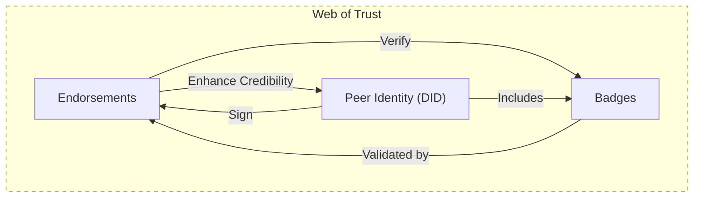

**Endorsements** are verifiable statements made by one **[[Peer]]** to support either **[[Badges]]** or an entire **[[Peer Identity]]** (endorsing their [[DID]]). They serve as a fundamental building block of the **[[Web of Trust]]**.

Endorsements are implemented through the **[[Endorsement Protocol]]** which provides:

1. **Cryptographic Verification**
   - Each endorsement is signed by the endorser's DID
   - Signatures can be verified by any peer
   - Content-addressable URIs ensure integrity

2. **Flexible Endorsement Types**
   - Profile endorsements (entire DID)
   - Badge endorsements (specific claims)
   - Extensible for future endorsement types

3. **Trust Chain Building**
   - Endorsements contribute to the web of trust
   - Trust can be evaluated through chains of endorsements
   - Helps establish reputation without central authority

## User Experience

Endorsements are:

- **Cryptographically Verifiable**: All Endorsements are cryptographically signed by the endorsing peer
- **Selectively displayed**: Users have full control over which Endorsements to display publicly
- **Trust-building**: Help establish credibility within the network
- **Decentralized**: No central authority required for validation

The Smash client application **SHOULD** clearly display whether any of the User's **[[trusted peer]]s** have endorsed their Badges or DID.

## Integration with Other Components

Endorsements work closely with:
- **[[Web of Trust]]** - Building trust networks
- **[[Badges]]** - Verifying specific claims
- **[[Trust Tokens]]** - Special type of endorsement
- **[[Peer Identity]]** - Core identity verification

