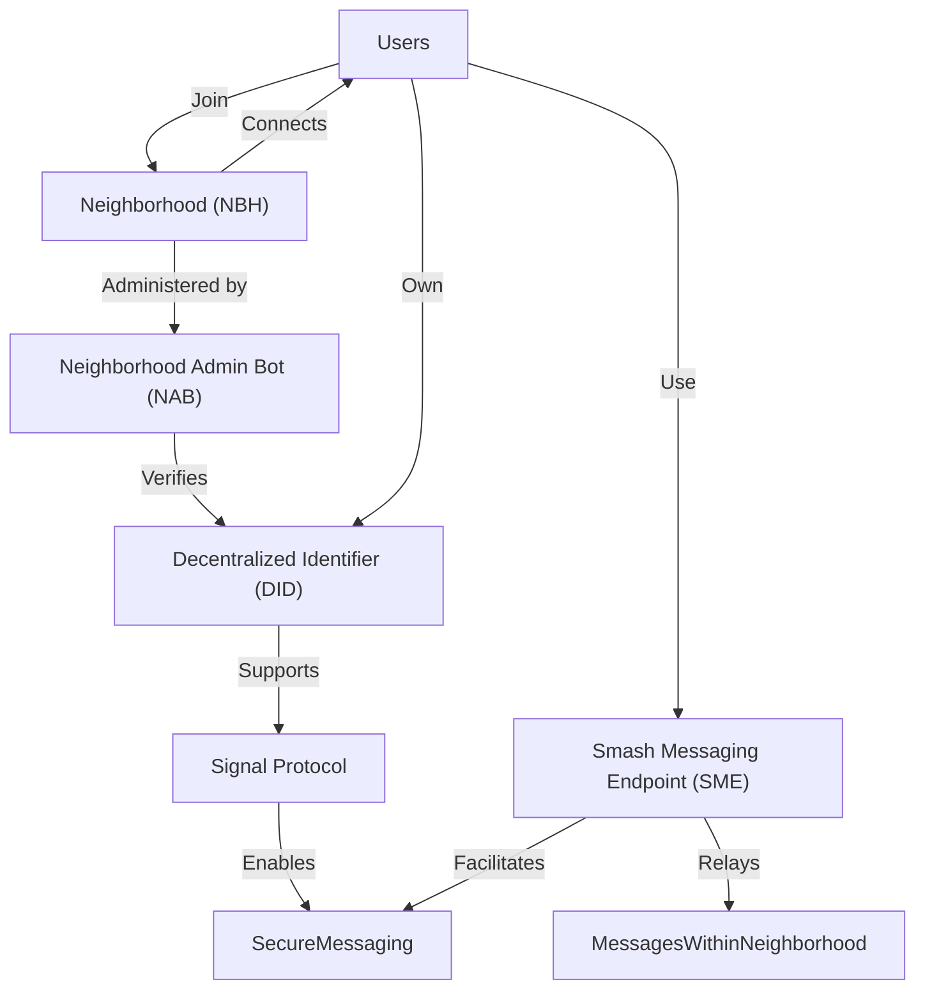

Smash is an **open-source, community-driven project created to enable true free competition among messaging apps**. It frees users **by giving them full ownership of their personal data and social connections**, leveraging **decentralized and distributed infrastructure** technologies.

**Smash is designed to be fully compatible with [[ATProto]] ([[Bluesky]]).** The [[Smash Protocol]] enables the Instant Messaging capabilities that are currently not implemented in [[ATProto]] ([[Bluesky]]'s implemented some temporary, off-protocol, [basic and non-decentralized DM feature](https://docs.bsky.app/blog/2024-protocol-roadmap#product-features)), and [[ATProto]] will enable the public discourse capabilities that are outside Smash's scope. 

- The **[[Smash Protocol]]** defines the concepts and procedures for communication security using proven encryption ([[Signal Protocol]]), data privacy, decentralized authority, and interoperability.
- **[[Smash Neighborhoods (NBH)]]** may implement the [[Smash Protocol]] freely and independently to deliver value to their targeted users. Neighborhoods can create any social app on top of the protocol, customizing it to suit their needs. They can offer free or paid services, but they [[Smash Licence|must open-source]] any changes to the protocol or to any provided open-source code. In exchange, Neighborhoods may get access to a [[Social Graph|partial social graph]], trading their added value for user-consented metadata.
- The **[[Smashchats]] client application** provides a generic social app UI/X implementation of the [[Smash Protocol]] for users to connect to any neighborhood and interact with all other users.

Smash operates as a decentralized peer-to-peer network, with locally centralized service authorities: [[Providers]].

[[Providers]] collaborate to serve [[Smash Neighborhoods (NBH)]], and users are free to join, trust, or create their own neighborhoods. All [[Smash Neighborhoods (NBH)]] are autonomous and can adopt their own governance model. Legal compliance is the responsibility of [[Smash Neighborhood Admins]], Operator Hosts, and ultimately, Smash Users.

The [[Smash Protocol]] includes mechanisms to [[Reporting|report a user]] and ensures full [[GDPR]] compliance. The final decision on reports lies with the [[Smash Neighborhood Admins]].

Under the terms of the [[Smash Licence]], anyone can create their own client or components. However, any source code derived from existing source code or implementing the protocol interfaces MUST be open sourced and distributed under a compatible licence.

Smash is built on the [[Smash Principles]] and embodies [[Smash Values]].

[[Buy us a coffee]]

---

_“Be curious. Read widely. Try new things.  
What people call intelligence just boils down to curiosity.”  
— Aaron Swartz_
