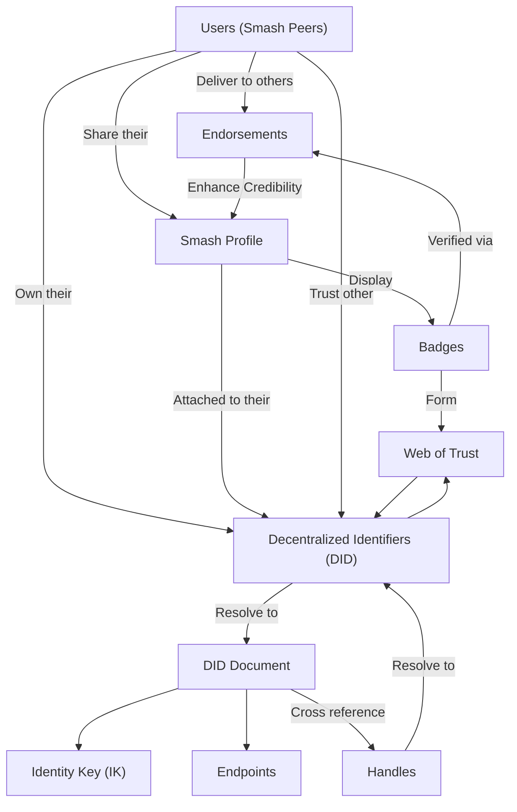

A Peer is the ultimate basic entity in the [[Smash Protocol]] / [[IMProto]], referring to any node participating in the network through a [[Peer Identity]] ([[DID]]).

Peers leverage their [[Peer Identity]] to encrypt and exchange data using the [[Smash Messaging Protocol]] and [[Signal Protocol]].

Peers establish their communication preferences using their [[Peer Identity]] through the corresponding [[DID document]]. This includes any configured [[Messaging Endpoints]].

