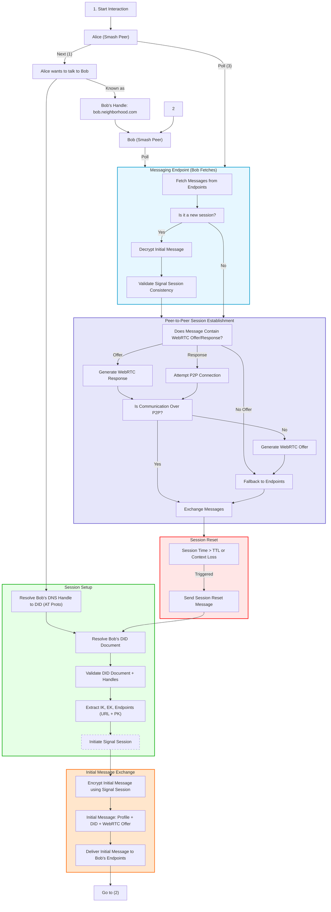

> renaming to [[IMProto]]

The Smash Messaging Protocol defines a set of procedures, data structures, and exchanges in order for two [[Peer|Peers]] to exchange data over the network in an encrypted manner.

The underlying communications are encrypted using the [[2key-ratchet library]] implementation of the [[Signal Protocol]].

