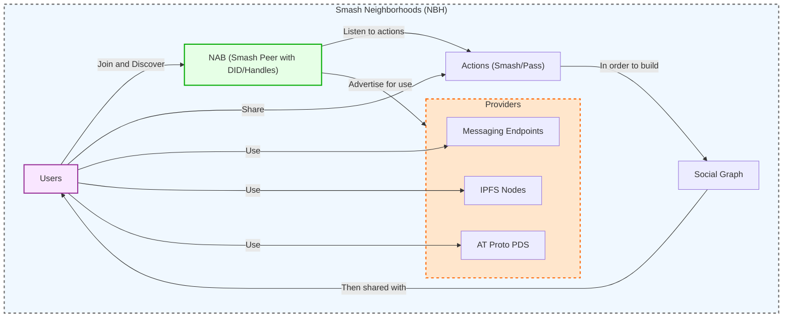

A **Smash Neighborhood (NBH)** is an abstract concept instantiated by [[Peer]]s who share common interests, designed to organize and empower web communities.

Much like real-world neighborhoods, Smash Neighborhoods can vary in quality. You might believe you can trust their administrators, or not. You can visit for specific activities, meet particular people, or simply explore. Whether it’s work, play, creation, study, or conversation—neighborhoods support the full spectrum of social activities. They offer spaces where you can build a reputation, share creations, find inspiration. 

Neighborhoods are identified by the [[Handles]] of their [[Neighborhood Admin Bot (NAB)]], a special type of [[Peer]] that operates within the network. These handles (strings of characters) gradually build reputation and trust over time (ie, a [[Brand Value]]).

In practice, a neighborhood is a set of [[Providers]] deployed by [[Smash Neighborhood Admins]], as individuals or organisations. The [[Smash Protocol]] is then used to power any social application or service, selecting the relevant [[Core components (Infrastructure)]].

Neighborhoods can construct their own [[Social Graph]]s based on users' [[Smash or Pass]] interactions observed by the [[Neighborhood Admin Bot (NAB)]]. This information allows them to offer valuable services, such as connecting users based on shared interests or behaviors.

Since Neighborhoods are trusted through the [[Web of Trust]], they (via their NAB) can also issue [[Badges]] to users, enhancing users' reputations and integrating them into the community’s fabric.

- Example: https://github.com/smashchats/smash-simple-neighborhood
