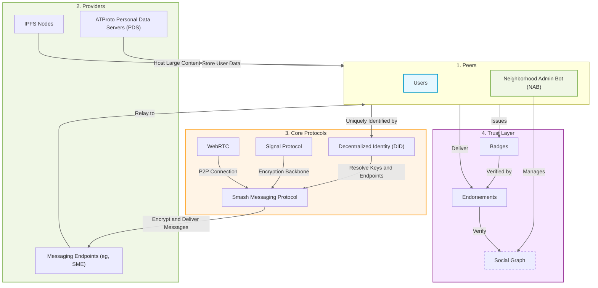

The **Smash Protocol** is a meta-protocol designed to build private, distributed, and decentralized social messaging applications by combining both existing technologies and custom implementations. It operates as a peer-to-peer (P2P) network, emphasizing privacy, data ownership, and decentralization. Smash is designed to support community-driven social platforms where users retain full control over their data, identity, and interactions.

> Note: The overall Smash meta protocol will likely evolve into something like '[[IMProto]]' as a more generic protocol for decentralized instant social messaging. The Smash Protocol would then focus on Smash-specifics interactions and features.

The protocol enables secure and encrypted communication, real-time interactions, decentralized identities, and user-controlled communities ([[Smash Neighborhoods (NBH)]]). By leveraging these technologies, Smash is an adaptable platform that can be used for both private messaging and broader decentralized social ecosystems.

- [[Executive summary]]
- [[Subprotocols]]
- [[Smash Concepts]]

> Note: This is all Work In Progress and quickly evolving.
> **Do not consider these Notes as actual specifications.**
> Proper—versioned—documentation is planned!

---

_"The web as I envisaged it, we have not seen it yet. The future is still so much bigger than the past." Tim Berners-Lee_
